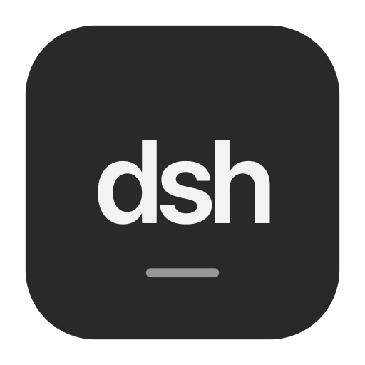
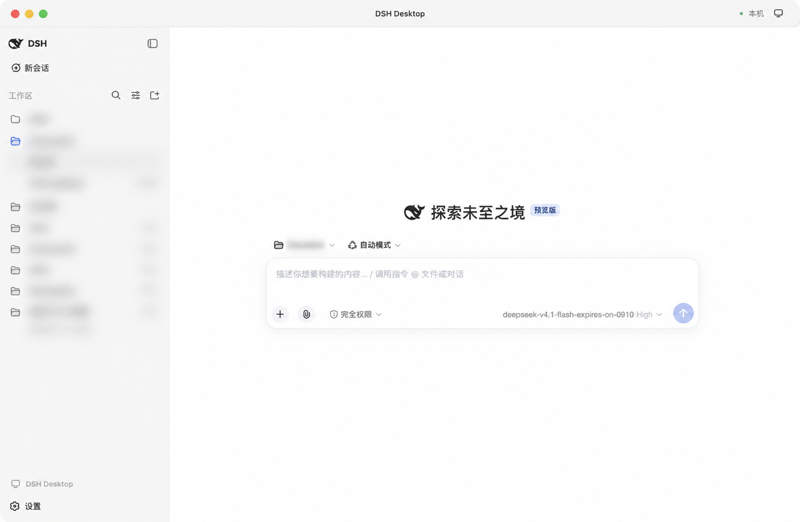

# dsh-app



[简体中文](README.md) | English

An independent DeepSeek Harness desktop application for **macOS Apple Silicon**, **Windows x64**, and **Kylin V10 SP1 on LoongArch64**.

The app bundles Node.js and the DSH core, with its own Electron main process, React entry point, and Cordis composition. There is no need to start DSH Web beforehand. Sessions, models, tools, approvals, and attachments use DSH's core services and functional components.

## v0.1.32: mobile previews, downloads, sharing, terminals and voice input

Android 0.12.5-dsh.4 previews Office files as PDFs converted on the computer, animates GIFs, and plays media from bounded private cache downloads. Original files can be saved to the phone or shared through Android's system chooser. Phones with control access can use the computer's interactive terminal. Finish a voice recording to transcribe it on the computer and automatically send the text; cancellation, navigation and backgrounding retire the recording.

## v0.1.31: stable phone connections

Fix the reconnect loop caused by rejecting the phone's job status subscription. Rejected subscriptions now return an individual stream error while other streams stay connected. Android 0.12.4-dsh.3 also converts tunnel failures into UI errors instead of crashing. Existing bindings remain valid.

## v0.1.30: scan to connect

Desktop now pairs phones with a short-lived QR code. Same-network connections work without a relay; registered computers also support automatic relay fallback. Android opens the existing chat interface after scanning, with computer switching, globe markers, and unbinding in the sidebar. Both ends support revocation, including queued offline requests. Closing the desktop window keeps the Host running until explicit Quit.

See [remote access setup](docs/REMOTE-ACCESS.md) for pairing, builds, and relay upgrades.

## v0.1.28 preview updates

Desktop **0.1.28** supports and bundles **DSH `0.2.0-rc.1`**, with compatibility updates for the local Auto, Audit, and Progressive Tools plugins.

- **Voice input in DSH on all three platforms:** record from the chat composer on macOS, Windows, and Kylin. Microphone access is restricted to the current DSH main page; camera access and recording from embedded pages remain denied.
- **macOS and Windows:** Electron `44.4.5`; macOS requires version 13 or later. Real microphone recording and synthetic-speech transcription have been verified on macOS. Windows microphone capture and permission isolation passed with simulated audio devices; its physical microphone and system privacy settings still need on-device checks.
- **LoongArch Kylin:** retain Electron `31.7.7` for Kylin V10 SP1 2403, old ABI (`ELF flags 0x3`), and glibc `2.28`. This compatibility build does not include the newer Chromium security updates in Electron 44.
- **Offline Kylin speech:** bundled SenseVoiceSmall INT8 and Silero VAD models use scalar WebAssembly, without SIMD or an online transcription API. The default INT8 configuration uses the included local files without a first-run model download. Keep the default INT8 option; FP32 is not bundled.

On macOS and Windows, prepare or download the speech models before using offline transcription; these packages do not include the Kylin model payload. Kylin's speech worker and offline failure cases passed tests on macOS with the matching Node version, and the Debian package passed static/ABI checks. **The new Kylin app, real microphone capture, transcription speed, and KYSEC behavior have not been verified on the target machine.**

Browser Use and Computer Use are available on macOS and Windows. They are not enabled in the Kylin build; its sidebar browser and file previews remain available.

The `main` branch contains Desktop `0.1.28` source, including the three-platform speech adaptations and compatibility patches. The [v0.1.28 release](https://github.com/yhfgyyf/dsh-app/releases/tag/v0.1.28) publishes Windows and Kylin installers; macOS can be built from the current source.

## v0.1.12 preview updates

This release adds **common file previews in the sidebar** and fixes Windows text encoding and path handling.

- **Simpler title bar:** remove the Runtime status icon from the top-right corner on Windows and macOS.
- **Local Office previews:** Word DOCX text, images and tables; PowerPoint PPTX slides; and multiple Excel XLS/XLSX worksheets. ODS, CSV and TSV are also supported.
- **Windows TXT fixes:** UTF-8, UTF-16LE/BE and GBK/GB18030 decoding, with manual Big5 and Windows-1252 choices. Chinese names, spaces, drive-letter case and files outside the workspace are handled.
- **Images, audio and video:** BMP, ICO, AVIF, MP3, WAV, FLAC, MP4, WebM and related formats gain local previews or playback controls. Existing PDF, HTML/Canvas, SVG, Markdown and code previews remain available.
- **Clear format limits:** legacy DOC/PPT files explain conversion to DOCX/PPTX/PDF; damaged, encrypted or oversized documents show actionable messages.

Office files are processed locally. Word/PowerPoint previews disable network resources and external links; complex layouts, fonts, animations and some charts can differ from Office. Spreadsheets show saved cell values without recalculating formulas or executing macros, limited to the first 200 rows, 40 columns and 100 sheets. Use Open locally for the complete document. Complete-file previews are limited to 32 MiB, or 25 MiB for spreadsheets. Audio/video playback depends on the available codecs.

## v0.1.10 preview updates

This release updates **Computer Use**, improving coordinate targeting, native input, and visual feedback after actions.

- **More reliable computer-use coordinates:** targets use 0–1 relative coordinates across the entire screenshot, including the title bar. Moving or resizing a window invalidates old coordinates and requires a fresh observation.
- **Native input fixes on macOS:** foreground clicks move the physical pointer, preventing shortcuts from reaching the wrong area after a window is reactivated. Long foreground text input stops if the target loses focus, and paste verifies the clipboard contents before delivery. The physical-pointer fix applies to the macOS native driver.
- **Feedback after actions:** window actions return a fresh screenshot and observation ID by default. Live picture-in-picture preserves keyboard focus and provides an immediate Stop control.
- **Bundled core upgrade:** the app ships DSH `0.1.5-rc.1` with migrated, verified local compatibility patches while preserving session write locks, tool-call consistency checks, and sharing with Web/TUI.
- **Source preview fix:** an HTML file's Source action opens plain text immediately. Manual viewer choices survive tab switches and reloads.

## Interface preview



Workspace names and session details are blurred for privacy. The model name remains visible.

## Download and use

Download the package for your platform from [GitHub Releases](https://github.com/yhfgyyf/dsh-app/releases):

| Platform | Package | Installation |
| --- | --- | --- |
| macOS 13+ Apple Silicon (v0.1.28) | `DSH-Desktop-*-macOS-arm64.zip` | Extract the ZIP and move `DSH Desktop.app` to your Applications folder |
| Windows 10/11 x64 | `DSH-Desktop-*-Windows-x64-Setup.exe` | Run the installer; it installs for the current user by default, without administrator privileges |
| Kylin V10 SP1 2403 / LoongArch64 old ABI | `DSH-Desktop-0.1.28-Kylin-V10-loongarch64.deb` | Install manually using `DSH-Desktop-0.1.28-Kylin-README.md` from the release, including its KYSEC steps when applicable |

Open the app, configure your provider and API key in **Settings → Models**, select a workspace, and create a session. Existing DSH users can reuse their configuration in `~/.dsh`, or `%USERPROFILE%\.dsh` on Windows. Node.js and DSH are included in the package and do not require a separate installation.

Each release includes `SHA256SUMS.txt`. Starting with v0.1.1, the macOS package has a complete ad-hoc signature, but it is not signed with an Apple Developer ID or notarized. If macOS blocks the first launch, dismiss the warning, open **System Settings → Privacy & Security**, find DSH Desktop, and click **Open Anyway**. Complete any confirmation requested by macOS. See [Apple's instructions](https://support.apple.com/en-us/102445). The v0.1.0 Mac package had a signature defect; download v0.1.1 or later.

The Windows installer is not code-signed, so Windows may ask you to confirm its source. Uninstalling removes the program while preserving DSH sessions and user configuration.

On macOS and Windows, starting with v0.1.2, the app automatically checks published GitHub Releases, including previews. Kylin does not support in-app updates; install its new `.deb` manually. A small title-bar icon appears when an update is available: click to download, then click again after verification to restart and install. Wait for running tasks to finish first; sessions, configuration, and a backup of the previous app are preserved. In Settings, the Desktop application section offers checks once at each startup (the default) or daily at a chosen local time while the app runs. Versions v0.1.1 and earlier require a one-time manual upgrade.

Starting with v0.1.6, Windows updates retain the entire old installation in an adjacent backup directory before installing and launching the new version, avoiding overwrite failures while old DLLs remain loaded. Failed installations restore and reopen the old app. If an older updater fails to restart, install the new release manually once.

Update downloads use the system proxy. Failed installations can be retried using the verified download. On macOS, an app running from a read-only temporary location is copied into the user's `~/Applications` folder before updating, with an old-version backup; the original app stays in place.

## Features

- Workspace and session lists, history, renaming, branching, deletion, search, and log export.
- Streaming text and reasoning, Markdown, code, tool details, images, and MP4 attachments.
- Model provider configuration, permission approvals, plans, goals, questions, workflows, and subagents.
- Standard, PTC, Minimal, Creative, Auto, and Audit presets; model reasoning effort is configured separately.
- Native menus, file and directory pickers, download saving, zoom, window state, and recovery from core failures.
- Voice input in the chat composer on macOS, Windows, and Kylin, with the model preparation and validation limits described above.
- Browser Use and Computer Use on macOS and Windows; sidebar web previews also remain available on Kylin.
- Conversation links open in right-sidebar browser tabs; file previews include Office documents, spreadsheets, text, code, Markdown, HTML/Canvas, SVG, images, PDF and common audio/video formats.
- Existing file paths in replies open directly, images have thumbnails, and the right sidebar collapses when its last file or browser tab closes.
- Select text in chat or the right sidebar and right-click to copy it. Editable fields also offer cut, paste, undo, and select all.
- Open locally uses the system's default application for the current sidebar file. Its menu offers another application, reveal in folder, and file or folder pickers. Without a current file, it opens a file picker; opening the workspace folder remains a separate menu item.

Desktop `0.1.28` bundles DSH `0.2.0-rc.1`, Auto Router `0.2.4`, Audit `0.6.1`, and Progressive Tools `0.3.2`. TUI `0.2.0` is used for compatibility testing across the three interfaces and is installed separately into DSH's TUI profile. Exact Git commits are pinned in the [dependency manifest](runtime/dependencies.json).

Some features depend on your model or external tools. MP4 attachments require a provider that supports `video_url`. Audit's Codex and Claude Code backends require their respective CLIs; a DSH model backend can also be configured. The installer does not include model accounts, API keys, or these external CLIs.

## Sharing with Web and TUI

The app, Web, and TUI can share the same `DSH_HOME`, which defaults to `~/.dsh`. Sessions, attachments, workspaces, and API credentials are stored there. Since DSH 0.1.7, model and UI settings are stored separately for each profile. Desktop imports legacy settings on first launch and preserves the original files; subsequent profile settings remain independent. The app's own profile, window and port state is stored in the `DSH Desktop` directory under the system's Application Support or AppData folder.

Codex sign-in uses DSH's authorization service and shared credential store. The existing provider refreshes expired tokens. See [build instructions](docs/BUILDING.md) to enable it in Web/TUI. In TUI, use `/login openai-codex` (`--device` for remote terminals), `/auth` for status, and `/logout openai-codex` to sign out. Authorization input is excluded from chat and input history.

The official session lifecycle lock allows only one process to write to a session at a time. Other interfaces receive an ownership error when they try to resume, modify, or delete a session that is in use. They can take over after the owning process exits. Switching pages does not guarantee that a session is released, and following an active stream live across separate processes is not currently supported.

Local patches provide deletion, MP4, and some older-event compatibility. **They do not replace the official session write lock or relax tool-call consistency checks.** Previously corrupted logs may still need separate repair. The patches and their verification manifests for Desktop 0.1.28 are in [patches](patches/dsh-0.2.0-rc.1).

## Univer Office plugin upgrade

DSH `0.2.0-rc.1` checks third-party plugin compatibility. Official `dsh-univer-office` `0.3.2` and `0.3.5` do not declare support for this core. Updating Desktop does not replace plugins in a user profile.

This repository can build `0.3.5-desktop.1` from the official `0.3.5` archive, preserving the `telemetry: false` default and `right` alignment fix while adapting client registration. Install the generated `.tgz` through **Settings → Plugin marketplace → Add manually**, then restart Desktop. See the [compatibility package guide](patches/univer-office-0.3.5-dsh-rc1/README.md) for provenance, builds, validation scope, and rollback. This is a project compatibility build, not a new upstream npm release.

## Computer use (macOS and Windows)

Enable Computer use in Settings or through the title-bar monitor icon. The app checks and requests system permissions; the switch shows on only after permissions are available and startup succeeds. Enabling it authorizes computer use without a separate prompt for each task. This switch is independent of file and command approvals. Turning it off stops input immediately; the model cannot enable it.

Selecting a window opens live picture-in-picture. You can hide it, reopen it from the Computer use menu, or click Stop now at any time. It does not steal keyboard focus and closes when the task ends. Window actions return a fresh screenshot and observation ID by default so the model can check the result. When creating desktop application files, the model checks existing windows, preserves open documents, and opens the saved result to inspect its view, colors, and framing.

Coordinates use 0–1 relative values across the complete screenshot, including the title bar. Picture-in-picture captures do not change the action screenshot's coordinate scale. Moving or resizing a window invalidates old coordinates and requires another observation. Action results distinguish input delivery from the subsequent observation; the actual outcome still needs to be checked against the task.

On macOS, foreground keyboard input can first target an editor with coordinates. Foreground clicks synchronize the physical pointer while enforcing the target window, preventing shortcuts from following an old pointer position when the window is reactivated. Subsequent shortcuts and typing omit coordinates and control targets to preserve the selection. Long text input stops if focus leaves the target window. The `type_text` tool's `method="paste"` writes and reads back the clipboard before sending the paste shortcut to the specified window. After an input error, observe the actual content before retrying; do not resend text based only on a character count.

The global stop shortcut is `Command + Option + Shift + Escape` on macOS and `Ctrl + Alt + Shift + Escape` on Windows.

macOS requires Accessibility and Screen Recording permissions for DSH Desktop. The current macOS test package uses ad-hoc signing, so an upgrade may require new authorization. If System Settings shows permission enabled but the app cannot enable Computer use, or macOS reports a signature mismatch, follow [permission checks and recovery after an upgrade](docs/TESTING.md#macos-upgrade-permissions). Restarting or passing signature verification does not by itself prove that previous permissions remain valid.

Distribution with stable permission identity across updates requires Developer ID signing from a fixed developer team and Apple notarization. See [signing, permission migration, and build commands](docs/MACOS-SIGNING.md).

Screenshots require an image-capable model, such as `deepseek-v4-flash-vision-exp`; text-only models can use window accessibility trees. Tools support finding applications and windows, screenshots, clicks, typing, keyboard shortcuts, scrolling, and dragging. One session owns the desktop at a time, with release on completion, cancellation, screen lock, or App exit. Windows requires an interactive logged-in desktop; the lock screen and UAC secure desktop are unavailable. Full-desktop capture currently targets the primary display; other displays can be observed through individual application windows.

## Build from source

The current `main` source is Desktop `0.1.28` with DSH `0.2.0-rc.1`. The standard commands below build the macOS/Windows app. Kylin requires a separate old-ABI environment; see the [Kylin speech overlay](patches/loongarch-speech/README.md) for its offline speech build and pinned sources, and use the release installation guide for the `.deb`.

Install Git, Node.js **24.15.0**, and npm, then run:

```sh
npm ci
npm run setup:runtime
npm run check
npm start
```

`setup:runtime` downloads the pinned DSH version and plugin commits, verifies and applies the patches, and creates an independent `.runtime` directory. It does not read or copy your DSH configuration, credentials, or sessions.

```sh
npm run package          # macOS: requires Swift and iconutil
npm run package:windows  # Windows x64: requires Inno Setup 7
```

For Windows, you can also run **Build Windows installer** manually from the repository's Actions page. The workflow runs checks and compatibility tests, packages the app, verifies silent installation, startup, shutdown, and uninstallation, and makes the build artifacts available for download.

More information: [Building](docs/BUILDING.md) · [Architecture](docs/ARCHITECTURE.md) · [Testing](docs/TESTING.md) · [Third-party notices](THIRD_PARTY_NOTICES.md).

This is an independent project, not an official DeepSeek or OpenAI product.
