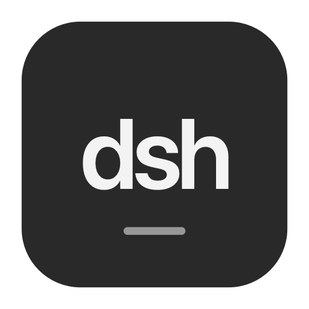
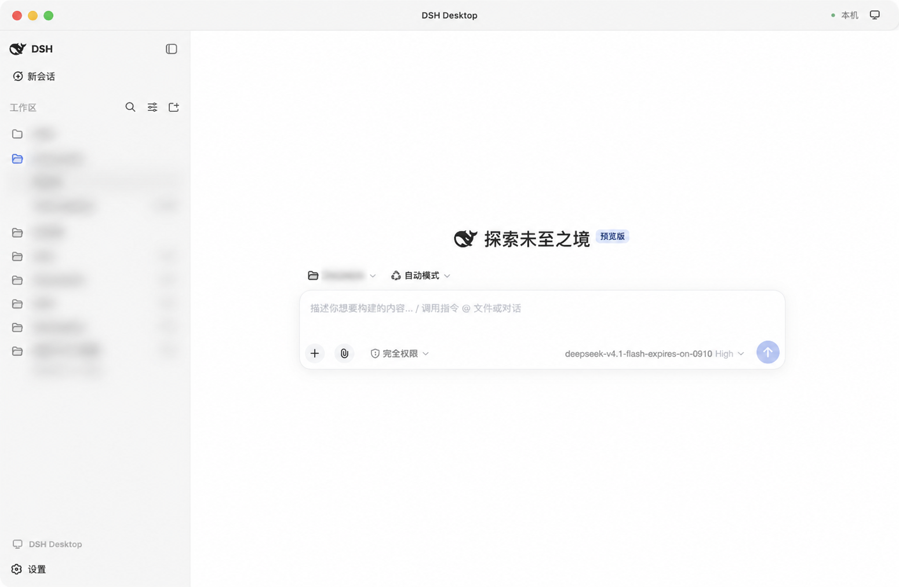

# dsh-app



简体中文 | [English](README.en.md)

独立的 DeepSeek Harness 桌面应用，支持 **macOS Apple Silicon** 和 **Windows x64**。

应用内置 Node.js 与 DSH 核心，使用独立 Electron 主进程、React 入口和 Cordis 组装。无需预先启动 DSH Web。会话、模型、工具、审批和附件复用 DSH 的核心服务及功能组件。

## 界面预览



工作区名称和会话信息已模糊处理，模型名称保留显示。

## 下载与使用

从 [GitHub Releases](https://github.com/yhfgyyf/dsh-app/releases) 下载对应版本：

| 平台 | 安装包 | 安装方式 |
| --- | --- | --- |
| macOS Apple Silicon | `DSH-Desktop-*-macOS-arm64.zip` | 解压，将 `DSH Desktop.app` 放入应用程序目录 |
| Windows 10/11 x64 | `DSH-Desktop-*-Windows-x64-Setup.exe` | 运行安装程序，默认按当前用户安装，无需管理员权限 |

打开应用，在“设置 → 模型”配置提供方与密钥，选择工作区并创建会话。已有 DSH 用户直接沿用 `~/.dsh` 中的配置；Windows 默认对应 `%USERPROFILE%\.dsh`。安装包内已包含运行所需的 Node 和 DSH，无需另外安装。

每次 Release 提供 `SHA256SUMS.txt`。macOS 从 v0.1.1 起使用完整的 ad-hoc 签名，尚未使用 Apple Developer ID 签名或公证。首次打开若被阻止，先关闭提示，再到“系统设置 → 隐私与安全性”找到 DSH Desktop，点击“仍要打开”，按系统要求确认；参见 [Apple 官方说明](https://support.apple.com/zh-cn/102445)。v0.1.0 的 Mac 包存在签名缺陷，请重新下载 v0.1.1 或更新版本。

Windows 安装包尚未代码签名，系统可能要求确认来源。Windows 卸载会移除程序，保留 DSH 会话和用户配置。

从 v0.1.2 起，App 自动检测本仓库已发布的 GitHub Release（包含预览版）。发现新版后，标题栏出现小更新图标，点击即开始下载；校验完成后再次点击图标重启安装。安装前请等待当前任务完成；会话、配置和旧版 App 备份会保留。设置中的“桌面应用”可选择“每次打开 App 检查一次”（默认）或“每日定时检查一次”，每日模式在 App 运行时按本地时间执行。v0.1.1 及更早版本需要手动安装一次新版。

更新下载使用系统代理。安装失败后可直接重试安装，复用已校验的下载包。macOS 若从只读临时目录运行，更新器会在用户的 `~/Applications` 中保留旧版副本并安装新版；原位置的 App 保留。

Windows 从 v0.1.6 起将旧安装目录整体保留在相邻备份目录，再安装和启动新版，避免旧版 DLL 仍被占用时覆盖失败。安装失败会恢复旧目录并重新打开应用。使用旧版更新器遇到无法重启时，请手动安装一次新版。

## 能力

- 工作区与会话列表、历史、重命名、分支、删除、搜索、日志导出。
- 流式文本、推理、Markdown、代码、工具详情、图片与 MP4 附件。
- 模型提供方配置、权限审批、计划、目标、问答、工作流与子代理。
- 标准、PTC、极简、创造、自动、审计预设；模型推理强度单独设置。
- 原生菜单、文件/目录选择、下载保存、缩放、窗口状态和核心异常恢复。
- 会话网页链接在右侧浏览器标签打开；文件侧栏支持 HTML／Canvas、SVG、图片与 PDF 预览，可切换查看源码。
- 回复中的已有文件路径可点击打开，图片提供缩略图；关闭最后一个文件或网页标签后，右侧栏自动收起。
- 聊天与右侧栏支持选中文字后右键复制，输入框提供剪切、粘贴、撤销与全选。
- “在本地打开”使用系统默认应用打开右侧当前文件；菜单可选择其他应用、在文件夹中显示、选择文件或文件夹。没有当前文件时弹出文件选择器，工作区文件夹作为单独菜单项保留。

内置 DSH `0.1.5-alpha.1`、Auto Router `0.2.4`、Audit `0.6.1` 和 Progressive Tools `0.3.2`。TUI `0.2.0` 用于跨端兼容测试，单独安装到 DSH 的 TUI profile。具体 Git 提交固定在 [依赖清单](runtime/dependencies.json)。

部分能力依赖所选模型或外部工具：MP4 需要提供方支持 `video_url`；Audit 的 Codex / Claude Code 后端需要对应 CLI，也可配置 DSH 模型后端。安装包不包含模型账号、密钥或这些外部 CLI。

## 与 Web / TUI 共享

App、Web 和 TUI 可共用同一个 `DSH_HOME`，默认 `~/.dsh`。会话、附件、工作区和模型配置在这里保存。App 自己的窗口与端口状态位于系统 Application Support / AppData 下的 `DSH Desktop` 目录。

Codex 登录通过 DSH 自己的授权服务保存到共享凭据文件，过期令牌由现有提供方自动刷新。Web/TUI 的安装步骤见[构建说明](docs/BUILDING.md)。TUI 使用 `/login openai-codex`，远程终端可加 `--device`；`/auth` 查看状态，`/logout openai-codex` 退出。授权输入不会作为聊天提交或进入输入历史。

使用官方会话生命周期锁：同一会话同时只有一个进程可以写入。其他端尝试恢复、修改或删除占用中的会话会收到占用错误；持有端退出后可以接手。切换页面不保证释放会话，跨进程实时跟随活动流也不属于当前功能。

本地补丁提供删除、MP4 和部分旧事件兼容，**没有替换官方会话写锁，也没有放宽工具调用一致性校验**。旧日志如已损坏，仍可能需要单独修复。补丁及其校验清单位于 [patches](patches/dsh-0.1.5-alpha.1)。

## 电脑操作

在对话中说明需要操作的应用和任务，模型会先申请本次任务的电脑操作授权。
标题栏的显示器图标可查看占用状态和系统权限；操作期间显示“停止电脑操作”。
全局停止快捷键为 macOS `⌘ + Option + Shift + Esc`、Windows `Ctrl + Alt + Shift + Esc`。

macOS 首次使用需为 DSH Desktop 授予辅助功能和屏幕录制权限。
截图操作需要支持图片的模型，例如 `deepseek-v4-flash-vision-exp`；纯文本模型可读取窗口的辅助功能树。
工具支持应用/窗口查找、截图、控件点击、输入、快捷键、滚动和拖动。
一次只允许一个会话操作桌面，完成、取消、锁屏或退出 App 后释放占用。
Windows 需要已登录的交互桌面；锁屏和 UAC 安全桌面不能操作。整屏截图目前对应主显示器，其他显示器上的应用可按窗口观察。

## 从源码构建

需要 Git、Node.js **24.15.0** 与 npm：

```sh
npm ci
npm run setup:runtime
npm run check
npm start
```

`setup:runtime` 下载指定 DSH 版本与固定提交的插件，检查并应用补丁，生成独立 `.runtime`。不会读取或复制用户的 DSH 配置、凭据和会话。

```sh
npm run package          # macOS：需要 Swift 和 iconutil
npm run package:windows  # Windows x64：需要 Inno Setup 7
```

Windows 也可在仓库 Actions 页面手动运行 **Build Windows installer**，执行检查、跨端测试、打包、静默安装、启动、退出和卸载验证，随后下载构建产物。

详情：[构建说明](docs/BUILDING.md) · [架构](docs/ARCHITECTURE.md) · [测试](docs/TESTING.md) · [第三方声明](THIRD_PARTY_NOTICES.md)。

这是独立项目，并非 DeepSeek 或 OpenAI 官方产品。
