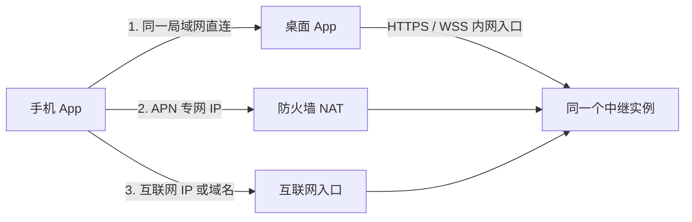

# DSH Remote 源码与本地验证

此功能使用 Desktop 0.1.32 / DSH 0.2.0-rc.1 的同一个 Host。桌面主动连接中继，Android 扫码后访问已有会话。远程开关默认关闭，点击扫码绑定时自动开启。Host 仍只监听回环地址；局域网使用独立的加密手机入口，中继连接由两端主动发起。

Desktop 0.1.31 与 Android 0.12.4-dsh.3 修复扫码后的断线重连循环及网络异常闪退。会话与任务状态通过同一条带心跳的 WebSocket 长连接订阅；拒绝某个操作时只关闭对应订阅，其他订阅继续运行。已有绑定无需重新扫码；本次连接修复不需要更新已支持扫码的 0.1.30 中继。

## 代码位置

- `src/main/remote-access*`：设置、加密凭据、一次性扫码授权与撤销。
- `src/runtime/remote/`：Host 桥接、接口权限、加密协议。
- `src/renderer/remote-access.tsx`：插件 → dsh-p2p-collab 详情 → 中继节点 / 手机远程控制（当前源码，插件 0.1.3）。
- `services/relay/`：自建中继。此分支默认入口为 `private-server`，原上游入口仅保留作参考。
- `mobile/android/`：原生 Kotlin Android 客户端；包名 `io.github.yhfgyyf.dshremote`，与上游分开安装。

上游来源及固定提交见 [REMOTE-SOURCES.json](../REMOTE-SOURCES.json)。Android 复用原有会话、历史、流、提问与审批界面。中央中继使用 `dsh-desktop-remote-v1`，新版配对码为 `dsh-desktop-pair` version 2。已有绑定仍可连接；旧二维码需要在新版桌面刷新。

## 中继准备

服务器建议使用 Node 22 LTS、Linux x86_64/arm64。桌面龙芯支持不代表服务器的 SQLite 原生依赖已经适配龙芯。

```sh
cd services/relay
npm ci
npm run build
export DB_PATH=/srv/dsh-relay/private-relay.sqlite
export PUBLIC_RELAY_URL=https://relay.example.com
export HOST=127.0.0.1
export PORT=8787
npm start
```

在前置代理配置 TLS 和 WebSocket；示例 [Caddyfile.private](../services/relay/Caddyfile.private)。公网和专网可以使用同一个域名，也可以按下节配置不同 IP 入口；所有入口必须到达同一个正在运行的中继实例。不要关闭证书校验。中继不需要访问桌面的局域网 IP。

### 专网 APN / NAT 与多个手机入口

桌面连接服务器内网地址，手机连接防火墙映射后的 APN 地址，是同一中继的两条接入路径，无需相同 IP 或 DNS。中继可配置专网、互联网手机入口列表，桌面注册和刷新二维码时从中继取得这些地址。

本节描述尚未发布的源码功能，已发布的 Desktop 0.1.32 / Android 0.12.5-dsh.4 不包含多个中继入口选择。需要同步更新中继、桌面和手机，再刷新二维码绑定。

以下 APN 和互联网地址仅是配置示例，须替换为实际的防火墙入口（端口也可不同）：

```sh
export PUBLIC_RELAY_URL=https://10.35.187.99:8443
export RELAY_CLIENT_ENDPOINTS='[{"origin":"https://10.80.0.9:8443","network":"private"},{"origin":"https://203.0.113.9:9443","network":"public"}]'
```

`PUBLIC_RELAY_URL` 保留旧配置含义和旧票据字段；桌面仍填写它实际可达的服务器地址（本例为 `https://10.35.187.99:8443`）。手机使用 `RELAY_CLIENT_ENDPOINTS` 中的入口，不需要能访问该服务器内网 IP。新手机客户端的 WebSocket 始终使用它已校验的入口，不跳回票据中的服务器内部地址。



- 最多配置 6 个手机入口，每项为 HTTPS origin（协议、IP/域名和端口），不含路径、查询参数、用户密码或重复项；单项地址不超过 256 字符。`network` 只能是 `private` 或 `public`，由管理员指定，不按 IP 范围推断。没有互联网入口时，只列出专网入口。
- 手机按 **可用局域网 → private → public** 尝试；同类入口按配置顺序。健康连接保持当前链路，断开后重新选择；新的 API 连接也会重新检查优先入口。没有更高优先级网络可用时，可从已授权的互联网入口连接。
- 自动选择针对可达的服务入口。APN、系统 IP 路由和防火墙 NAT 需预先配置；App 不切换 APN，也不强制某个请求使用 Wi-Fi 或蜂窝网络。手机同时连接多个网络时，目标 IP 仍须能通过系统路由到达对应入口。
- 列表是同一个中继实例的别名。所有 NAT/TLS 前端都必须转发 `/health`、`/v1/*` 和 WebSocket Upgrade；仅让首页或健康检查可访问不够。不要把列表配置成多个独立中继进程：桌面在线连接和单次票据保存在进程内存中，仅共享数据库也不够。
- 新中继在自己的 SQLite 库新增 `remote_metadata`，保存非秘密 `relayId`。手机在发送绑定凭据前先验证入口的 HTTPS 证书和 `/health` 返回的标识与二维码相符，拒绝重定向和不同实例；该标识不能代替 TLS 校验。部署前按原流程备份数据库及 WAL/SHM。
- 用 IP 访问时，服务器证书的 **IP SAN** 必须包含客户端实际使用的地址。TLS 透传 NAT 不会改写证书，因此同一张证书应覆盖相应内网/APN/互联网 IP；若入口分别终止 TLS，各入口可使用分别签发的匹配证书。桌面和手机都需信任实际签发 CA；Android 版本已显式支持系统和用户安装的 CA。参考 [Android CA 配置说明](https://developer.android.com/privacy-and-security/security-config#ConfigCustom)。
- 每次二维码刷新会获取最新入口列表。二维码的入口与其 LAN 配对回执保持一致；配对期间配置变化不会让手机向未扫描的地址发送凭据。已绑定手机保存当时的列表，修改映射后需要重新扫码更新，旧绑定不会自动获得新入口。
- 保留 v2 二维码的单地址字段；没有配置此变量时仍是原来的 LAN/单中继模式，新版手机也可读取已有绑定。旧桌面和旧手机版本不能自动使用新增的多个入口；使用此功能需要同时更新中继、桌面和手机。旧版手机对新版二维码仍只使用其中的单一入口。
- 一次性配对请求发送后若响应丢失，刷新二维码再试；客户端不会在其他入口重放该请求。普通会话写操作同样不会因换路而自动重放。

配置的公网示例 IP `203.0.113.9` 是文档保留地址，不可直接使用。真实 APN 路由、证书链、防火墙和手机切网仍须在目标网络验收。

管理员在中继机器执行，密码通过标准输入送入，避免写入命令历史：

```sh
read -rs -p '新账号密码（至少 12 位）: ' remote_password
printf '%s' "$remote_password" | node dist/private-admin.js account operator@example.com
unset remote_password
node dist/private-admin.js registration operator@example.com
```

第二条管理命令输出一次性注册码，10 分钟有效。数据库和目录仅供服务账号读写，备份数据库及其 WAL 状态；不要把它们提交到仓库。没有开放账号注册的 HTTP 接口。修改中继地址前，先在桌面点击“解除注册”并确认，再重新注册；已有凭据不能直接发送到另一地址。

### 私有 CA 自动配置（Desktop 0.1.34 起）

桌面只需填写中继地址和完整注册码，无需在 Ubuntu 手动安装系统 CA 或使用 sudo。管理员使用服务器上已有的根 CA 证书生成带指纹的注册码：

```sh
node dist/private-admin.js registration operator@example.com --ca-file /path/to/relay-root-ca.pem
```

新码形如 `dshca1_<根CA的SHA-256指纹>_<原一次性注册码>`，仍然一次有效、10 分钟过期。CA 文件必须是根证书，不能使用服务器叶证书或私钥。旧版普通注册码和已注册设备继续按原方式工作。

无需更新或重启正在运行的中继：独立的 `registration-code.js` 只依赖 Node 内置模块，可以包装旧管理工具输出的注册码；沿用原来的 `DB_PATH` 和管理账号执行：

```sh
node dist/private-admin.js registration operator@example.com | node /path/to/registration-code.mjs /path/to/relay-root-ca.pem
```

桌面先通过 TLS 握手取得公开证书链，核对注册码中的根 CA 指纹，然后建立正常校验证书链、有效期和 IP/DNS SAN 的 HTTPS 连接，才发送一次性注册码。中继的 TLS 前端须发送该根 CA（例如在 fullchain 中附加根证书）。首次握手不发送注册码、设备令牌或 HTTP 请求；指纹不匹配、缺少根 CA、证书过期或地址不匹配都会拒绝注册。此流程采用[凭注册码中的 CA 摘要验证首次连接](https://docs.k3s.io/cli/token#tls-bootstrapping)的方式。

核验后的 CA 随中继凭据保存在 DSH 的加密配置中，仅供该中继的 HTTPS/WSS 使用；不修改操作系统的信任库，也不设置全局跳过 TLS 校验。系统密钥环不可用时仍遵守现有的“仅本次运行”限制。Android 的系统/用户 CA 配置不由此桌面功能修改。

中继注册与手机绑定分别保存。局域网配对成功、切换连接路径、临时断网、关闭远程开关、解绑手机或应用重启都不会自动解除已保存的中继注册；只有在桌面明确点击“解除注册”并确认，才删除中继身份和对应的专用 CA。

## 配对与使用

1. 桌面打开“插件 → dsh-p2p-collab”详情。插件关闭时也可填写中继和进行手机配对。
2. 同一局域网可直接点击“扫码绑定手机”。需要异地访问时，先填写 HTTPS 中继地址和管理员注册码，点击“注册电脑”。
3. Android 点击“扫码绑定电脑”，扫描桌面二维码。二维码有效 120 秒且只能使用一次；扫码即授予该手机会话控制权限，无需再次登录或选择连接模式。
4. 绑定后进入现有会话界面。手机侧栏以地球图标标记远程会话，顶部显示电脑名称、连接状态和主机切换菜单。
5. 桌面设备列表或手机侧栏都可“解绑”。离线手机会移除可用连接并保留加密的待同步撤销；恢复网络、再次运行 App 后重试。中继撤销记录会保留，离线桌面恢复后同步撤销对应 LAN 权限。
6. “解除注册”移除中继注册并收起协作空间，保留该电脑的局域网绑定；如需撤销一部手机的全部访问路径，请使用“解绑”。

协作空间需要同时满足插件已启用、中继已注册。尚未注册时不会显示协作入口，协作请求也会被拒绝；手机的同网段扫码功能不受该条件限制。本地协作身份和草稿在解除注册时保留。

手机优先连接二维码中同网段的 LAN 地址，失败时使用已登记的中继。纯局域网绑定不能跨网连接；后续注册中继或电脑局域网地址改变时，可重新扫码更新绑定。若配对时中继暂不可用，同网段仍可绑定，恢复中继后重新扫码取得后备路径。

关闭窗口默认后台运行：Windows/麒麟隐藏到系统托盘；macOS 最小化至 Dock，同时提供菜单栏入口；没有托盘时保留可恢复的最小化窗口。明确退出应用、关机或睡眠会中断连接。没有增加开机自动启动。系统密钥环不可用时绑定仅对本次运行有效，界面会明确提示。

二维码包含单次绑定的初始化密钥。每部手机独立授权，撤销不会影响其他手机；配对码不应转发给他人。远程接口不开放凭据管理、插件安装或任意代理 URL。终端、工作区二进制预览和语音转写仅向控制权限开放，沿用 Host 的会话与工作区范围检查。此前的只读绑定继续遵守原有权限边界。

已有中继必须同步升级此版本的 `private-server` 与 `private-store` 后，才能支持免登录扫码和手机主动解绑。更新前停服务并备份数据库及 WAL/SHM，启动时只新增邀请类型字段；账号、注册码、已有设备和绑定保留。旧中继仍支持旧绑定连接，但不提供本次新增的扫码 API。服务器部署不由桌面升级自动执行。

## 手机预览、下载共享与语音

Desktop 0.1.32 / Android 0.12.5-dsh.4 保持命令、Office 转换与语音识别在连接的电脑上执行，手机负责录音和显示。PNG 等图片、动态 GIF、PDF、DOC/DOCX、XLS/XLSX、PPT/PPTX 与常见音视频使用对应查看器。普通二进制预览及 Office PDF 上限 32 MiB，音视频上限 256 MiB，以 1 MiB 窗口下载到 App 私有缓存，关闭预览后删除；能否播放取决于手机支持的编码。

预览页的“下载到手机”使用系统保存位置选择器，支持保存到下载目录。共享始终发送原始文件，Office 不会替换成预览 PDF。已下载文件可直接通过系统分享面板交给其他 App，即使电脑已断开；未下载时先取得一份私有缓存，再打开分享面板。下载与共享上限为 256 MiB；失败或取消会删除本次未完成的传输，分享缓存保留供接收 App 读取，在后续共享时清理超过 24 小时的缓存。

点击输入框旁的麦克风，首次允许麦克风权限；点击结束后，由电脑返回识别文字并自动发送。已有草稿会与识别文字合并，附件沿用现有发送规则。取消、切换会话、进入后台、识别为空或失败时均不自动发送；文本提交失败时沿用草稿恢复机制。此功能是单次语音输入。

首次使用需在电脑端准备并选择本地语音识别模型；已经下载且处于待机状态的模型由手机唤醒。不会改用手机或第三方云识别。默认桌面配置启用已有的本地语音组件，既有语音 Bundle 和配置继续生效。本次改动不需要升级中继。

## 构建和检查

桌面：

```sh
npm run typecheck
node --test tests/remote-*.test.ts
npm run build
npm run test:remote-ui
cd services/relay && npm ci && npm run build && npm test
cd ../.. && node scripts/test-mobile-remote.mjs
```

最后一个脚本只使用 `.test-data/mobile-remote-*` 的隔离目录、回环中继和 App 自己的 Host，不接触日常配置，也不调用真实模型。

Android 需要 JDK 17、Android SDK 35 和 Gradle Wrapper：

```sh
cd mobile/android
./gradlew :core:test :app:testDebugUnitTest :app:assembleDebug --no-daemon
```

调试 APK 在 `mobile/android/app/build/outputs/apk/debug/`；发布构建应配置自己的签名，不使用上游的自动更新 APK。Android Keystore 保存每台电脑对应的手机凭据、加密密钥和待同步撤销。`DesktopScanTest` 使用 Android 核心代码与真实隔离 Host 验证 LAN 扫码、无账号中继扫码、自动回退、会话创建/改名和双路径撤销；该测试需要本机有可用 IPv4 私网接口。

## 协议和边界

- 注册、邀请、扫码认领与撤销使用 HTTPS。桌面 `/v1/device` 与手机 `/v1/tunnel` 主动 WSS 连接；凭据在第一帧认证，不写进 URL。访问票据只可使用一次，30 秒有效。
- 只有标记为新版扫码的邀请允许无账号认领，旧邀请不降低权限要求。邀请认领后立即作废；桌面校验当前邀请并写入绑定后才能获取访问票据。每部手机有独立绑定、令牌与 32 字节密钥。
- LAN 入口仅接收本机 IPv4 私网接口同网段的原生 WebSocket，拒绝浏览器 Origin 和未知 Host。配对、会话操作和主动解绑都经二维码密钥认证的加密通道，Host Cookie 不离开电脑。
- 内容采用上游 `sealed-tunnel-v1` 的 HMAC 握手、HKDF-SHA256 派生和 AES-256-GCM；检查方向、会话和严格单调序号。中继不持有解密密钥。此 PSK 方案没有前向保密。
- HTTP 上传和下载分块并确认，单文件上限 256 MiB；普通 RPC 响应限 16 MiB、Host mux 单帧限 4 MiB。服务和客户端都有有界队列，超限断开并明确报错。
- 重连重新握手，历史恢复沿用 DSH 的 snapshot/follow 和游标机制。写操作不会被隧道自动重试；prompt 使用 DSH 的稳定 requestId 去重。
- DSH 0.2.0-rc.1 Gateway 已广播待审批和提问，并在一端回答后向其他端发出撤回通知。测试直接验证安装版 Gateway 的此行为，因此没有再增加第二套审批存储。
- 麒麟本身尚未适配的 Computer Use / Chrome 登录接入不会由远程模块补齐。手机控制的是 Host 已有能力。

源码和本机验证不等于三平台安装包或真机验证。Windows、麒麟系统密钥环、托盘以及公网代理部署需要在相应环境验收；本次实现不会自动部署或发布。
