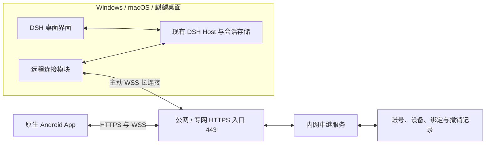

# DSH Desktop 三平台、Android 与自建中继完整实施方案

日期：2026-09-29。状态：已开始按本方案实现，代码与本地检查说明见 ../REMOTE-ACCESS.md；尚未部署或发布。

结论：Windows、macOS、银河麒麟 App 都需要更新。桌面显示配对二维码，手机负责扫描；桌面无需增加摄像头扫码能力。三平台复用同一套设置界面、远程协议与 Host 接入逻辑，分别处理密钥存储、后台运行和安装包兼容。

## 1. 目标与设计前提

目标是：管理员部署一套中继；桌面向它注册并主动保持连接；Android 扫描桌面二维码绑定设备；手机与桌面查看和操作同一份 DSH 会话。

本方案采用以下前提，部署阶段可以替换具体地址：

- 中继部署在用户可管理的 Linux x86_64 或 arm64 服务器，公网和专网入口均能转发到该实例。桌面端龙芯支持不等于中继服务器已支持龙芯。
- 私有部署采用管理员邀请账号；一个账号可绑定多台电脑、多部手机。第一版不做公开自助注册。
- 首个兼容基线固定为 Desktop 0.1.28 的当前源码、DSH 0.2.0-rc.1。未来版本通过兼容测试再加入支持矩阵。
- 远程访问默认关闭，由桌面用户启用。模型 API key、Browser Use 令牌和现有会话继续由原来的 Host 管理。
- 电脑在线且 DSH Host 运行时支持远程执行。窗口隐藏可保持运行；显式退出、注销或关机使设备离线。
- 本阶段目标是会话控制、消息和任务状态同步。同步鼠标画面、远程唤醒、云端接管离线电脑、iOS 客户端作为后续独立需求。

## 2. 当前源码与兼容事实

以下事实已通过本地代码和项目文档检查；它们不是此次新增功能的运行验证。

| 已核实事实 | 对设计的影响 | 证据 |
| --- | --- | --- |
| Desktop 0.1.28 使用 DSH 0.2.0-rc.1；Mac/Windows 的 Electron 依赖为 44.4.5 | 先固定当前兼容基线 | [package.json](/Users/yang/.dsh/dsh-desktop/package.json) |
| 主进程启动一个归 App 所有的 Node Host，实际地址由 ready IPC 返回，端口可能变化 | 接入现有 Host，不能写死 3080 或另起 Web profile | [runtime.ts](/Users/yang/.dsh/dsh-desktop/src/main/runtime.ts:57) |
| Host 监听 127.0.0.1；根路径只做认证握手并返回 204；明确拒绝 Web App/static 入口 | 原生手机接 API 可行；直接转发根页面给 WebView 无法显示当前 Desktop | [runtime/index.ts](/Users/yang/.dsh/dsh-desktop/src/runtime/index.ts:107) |
| 通用设置已有 Desktop 插槽与 preload IPC | 在现有位置增加远程控制入口，复用同一 UI | [plugin.tsx](/Users/yang/.dsh/dsh-desktop/src/renderer/plugin.tsx:101) |
| Windows/Linux 最后一个窗口关闭时会退出 App；退出会停止 Host | 要增加显式的关闭窗口后继续运行选项和托盘退出流程 | [index.ts](/Users/yang/.dsh/dsh-desktop/src/main/index.ts:356) |
| DSH 已有 history/follow、seq 缺口恢复和 prompt requestId 去重 | 复用会话协议，桌面 Host 保存权威状态 | [会话协议](/Users/yang/.dsh/dsh-desktop/.runtime/node_modules/@deepseek-ai/dsh-api-session-controller/README.zh.md:29) |
| 官方认证把通过认证的请求视为同一操作者；审批/提问使用 scoped waterfall | 远程权限不能只靠手机隐藏按钮；两端审批同步必须专项验证和适配 | [连接认证](/Users/yang/.dsh/dsh-desktop/.runtime/node_modules/@deepseek-ai/dsh-client-connection/README.zh.md)、[事件转发](/Users/yang/.dsh/dsh-desktop/.runtime/node_modules/@deepseek-ai/dsh-api-remotes/README.md) |
| 麒麟 0.1.28 包使用旧 ABI Node 22.16.0、Electron 31.7.7、glibc 2.28 | 网络模块须兼容 Node 22.16，界面须兼容 Chromium 126；不能引入现代 Linux 原生包作为必需依赖 | [麒麟包说明](/Users/yang/.dsh/reports/kylin-0.1.28-package-20260929/安装说明.md) |

当前麒麟包尚未适配 Computer Use 和复用 Chrome 登录的 Browser Use。远程模块必须按真实能力显示功能，不能因为连接成功就宣称与 Mac/Windows 的工具能力完全一致。

## 3. 总体架构与网络部署



### 部署方式

1. 中继首版采用一个实例和持久化数据库，前面放 Nginx 或 Caddy。入口代理负责 TLS 和 WebSocket 升级，聊天和附件在手机与桌面之间另做端到端加密。
2. 桌面和手机只需能访问中继入口；桌面不接收入站网络连接。桌面的 127.0.0.1 Host 保持现有绑定。
3. 公网与专网优先使用同一规范域名，分别解析到可达入口，并使用两端信任的证书。两入口转发到同一业务实例和数据库。
4. 若必须使用两个域名，扩展受信入口配置和访问票据生成：返回当前客户端可达的 WSS 地址。不得让专网手机获得仅公网可达的地址，也不得信任任意请求 Host 来生成票据。
5. 内网中继若没有可供公网入口转发的路由，需要在网关增加端口转发、专线或反向隧道。仅生成二维码不会建立这条网络路径。
6. 若公网与专网属于禁止互联的隔离区域，分别部署中继和绑定关系；共同实例的方案以允许互联为前提。
7. 专网 CA 在操作系统或应用的受控信任配置中安装，保持证书校验。生产环境不提供“忽略证书错误”开关。

### 中继职责

保留账号、设备 ID、手机绑定、一次性邀请、撤销状态和最少的运行元数据；维护桌面出站连接和手机访问连接的对应关系。主机名可由用户改为显示名，避免自动上传目录路径。

中继不持有 DSH 登录 cookie、模型凭据或消息解密密钥，不负责执行工具。聊天正文和附件的持久化仍归桌面 Host；中继仅使用有界内存转发密文。

中继重启后，桌面与手机重新连入并恢复绑定；消息恢复依赖 Host 历史，不依赖中继保存完整流。首版保持单副本，不能把同一个 SQLite 文件挂给多副本来宣称高可用。

## 4. 三平台桌面需要增加的功能

### 用户界面

在“设置 → 通用设置”增加一行“手机远程控制”，包含开关和“管理连接”按钮。详细配置放在管理面板，保持通用设置简洁。

面板包含：

- 中继地址、当前电脑名称、连接状态及最近错误。
- 首次设备注册入口；使用管理员发放的一次性设备注册码建立账号归属，避免在配置文件中保存管理员密码。
- “配对手机”：显示带倒计时的二维码，可取消或重新生成。
- 配对确认：显示手机名称和账号，选择“仅查看”或“会话控制”，由桌面确认。
- 已配对手机列表：权限、最近连接、在线状态、撤销单台、撤销全部。
- “关闭窗口后继续运行”：显式启用后关闭窗口隐藏到托盘；托盘支持打开、暂停远程访问、退出。
- 连接诊断和脱敏诊断导出。

默认不改变旧版关闭窗口的行为。用户启用后台运行后，三平台行为保持一致。检测不到可用托盘入口时保留窗口并解释原因，避免 App 隐藏后无法找回。显式“退出”始终断开远程访问并停止 Host；应用升级退出也不得被托盘逻辑拦截。

### 接入与进程生命周期

- Node Host 内运行远程桥接模块，等待本次 Host ready 后建立认证会话，使用真实 endpoint。主进程负责安全存储、设置和原生生命周期。
- 登陆 Host 所需的 launch token/cookie 仅在本机使用。远程请求先由桥接模块验证手机绑定和允许的方法，再以本机身份访问同一 Host。
- 中继不可达不会阻止本机 DSH 启动或聊天。连接状态按 disabled、connecting、online、reconnecting、error 展示，并区分 DNS、TLS、认证、协议版本和 Host 未就绪。
- 断线采用有上限的指数退避和抖动；网络恢复和系统唤醒触发重连。客户端离线不自动停止已经受理的模型任务。
- 暂停远程访问立即关闭远程通道，本地会话继续运行；撤销设备还要结束其已有通道。
- 配置切换中继时明确重新注册及配对，禁止把原中继凭据发送到新地址。

### 计划修改文件

以下新增文件名是实施建议，不表示文件已经存在。

| 文件/区域 | 修改内容 |
| --- | --- |
| `src/shared/remote-access.ts`（新增） | 配置、状态、能力、配对、设备列表和版本类型 |
| `src/main/remote-access.ts`（新增） | 设置控制、凭据加载、向 Node Host 发送配置并接收状态 |
| `src/main/remote-access-credentials.ts`（新增） | 独立的加密凭据存储，原子写入和撤销 |
| `src/runtime/remote-access.ts`（新增） | 出站连接、绑定认证、加密隧道、受限 Host 转发 |
| `src/runtime/remote-interactions.ts`（新增） | 桌面/手机待处理审批与提问的协调接口 |
| `src/renderer/remote-access.tsx`（新增） | 设置入口、二维码、确认与设备管理 |
| `src/main/index.ts`、`src/main/runtime.ts` | 生命周期、托盘、IPC、休眠恢复 |
| `src/shared/config.ts`、`src/shared/desktop-api.ts`、`src/preload/index.ts` | 可向后兼容的配置默认值和窄 IPC 方法 |
| `src/runtime/index.ts`、`src/runtime/desktop.patch.yml` | 在现有 Host 中组合远程服务，保留 loopback 认证 |
| `src/renderer/plugin.tsx`、`src/renderer/theme.css` | 接入设置插槽，匹配现有界面 |
| `scripts/build.ts`、运行时准备与打包脚本 | 将新增 runtime 文件和所需依赖打入三平台包；同步编译清单，避免源码存在但安装包缺文件 |
| `tests/remote-*.test.ts`、原生 UI/双端集成脚本（新增） | 状态、认证、传输、双端交互、退出与升级回归 |

只更改相关路径。保留当前工作区已有修改，实施前记录源码状态。新增生产依赖先列明用途、版本、许可证和平台兼容性，再按工作约定确认；本方案不安装依赖。

## 5. 扫码配对、身份和密钥

### 完整流程

1. 管理员建立私有中继账号，并为桌面签发一次性注册码。
2. 桌面填写地址并完成注册，生成自己的设备身份，主动建立 WSS 连接。注册不等于任何手机已获得控制权。
3. 用户点击“配对手机”，桌面申请短期一次性配对邀请，建议有效期 120 秒。二维码携带规范中继地址、协议版本、设备 ID、邀请 ID、一次性认领材料和端到端加密初始化材料。
4. Android 登录获邀账号并扫码，确认中继地址与电脑名称；桌面显示待绑定手机，由用户确认权限。
5. 双端完成加密握手后建立绑定。每个“手机—电脑”绑定使用独立凭据和密钥材料，不把多个手机合并为一个可共享的永久令牌。
6. 邀请一旦成功认领立即失效；取消、到期、换码均废弃原邀请。后续使用已绑定凭据自动连接，不重复扫码。
7. 撤销手机时，桌面本地先拒绝其后续操作并断开通道，中继同步废止授权；中继离线时保留撤销记录，恢复后优先同步。被撤销手机必须重新获得桌面批准才能绑定。

二维码不包含模型 API key、管理员密码或 DSH 全局 cookie。若用 URL 承载初始化秘密，只放 fragment，不放会进入 HTTP 访问日志的 query。二维码及初始化秘密同样不进入日志、诊断包或遥测。

### 加密方案与现有限制

优先复用 april-jk 当前 `sealed-tunnel-v1` 的消息封装、握手和加密实现，移植 Android 端时建立与 Node 实现互通的测试向量。使用平台已有的加密实现，不另创密码算法。

对上游进行代码评审和测试后才能采用；“开源已有实现”不等于通过独立安全审计。当前上游采用 QR 配置的预共享密钥，没有前向保密，首版须如实记录这一属性。每次连接使用新的会话派生材料，检查消息序号、方向及重放；密钥泄露须撤销并重新配对，邀请过期不能消除已泄露密钥的影响。

首版端到端内容密钥只留在手机与桌面。按绑定路由和授权，不把远端提供的任意 URL 作为本地请求目标；目标限定为 App 当前持有的 Host 及允许的 API/文件路由。

### 三平台凭据存储

| 平台 | 保存方式与前提 |
| --- | --- |
| macOS | 复用 Electron 系统加密存储，凭据独立于普通设置 |
| Windows | 使用系统加密存储保护设备凭据，限制文件 ACL，保持原子更新 |
| 麒麟 | 检测旧版 Electron 的 Secret Service/系统密钥环是否实际可用；不得把 `basic_text` 当作安全加密 |
| Android | 由 Android Keystore 保护绑定密钥；账号令牌与聊天缓存分开存放 |

麒麟缺少安全存储时，可提供“仅本次配对、重启失效”的明确模式；持久自动重连必须在密钥环可用后启用。若需要新增系统密钥环组件，列为目标机的明确依赖和安装步骤，不能静默改成明文保存。

## 6. 会话同步与权限

### 会话与流

- 同一电脑两端使用相同的 `sessionId`；手机按照设备分组，不把不同电脑的会话 ID 混在一起。
- 打开会话取得持久历史和当前状态，订阅 follow/control 等流；复用 DSH 对 assistant 临时流和最终持久消息的区分。
- 依据 seq/cursor 和当前 Host generation 恢复；缺口补历史，Host 重启重新取基线。不能只重放 WebSocket 原始帧。
- 手机提交 prompt 时保留稳定 requestId；确认已受理后才清除发送状态。网络失败后先查询/对账，再决定重试。
- 对没有幂等保证的停止、修改、审批等操作，不做无条件自动重发。离线输入先保存为手机草稿，恢复后明确提交。
- 两端同时发消息交给现有 DSH 队列/steering 语义，界面展示 Host 确认的结果。
- 手机新建会话优先选择 Host 已有工作区；新增工作区通过获授权的远程路径选择接口完成，不把手机操作转成需要电脑用户处理的原生目录弹窗。桌面的原生目录选择器保留。

### 审批与提问：单独的必过项

现有 DSH scoped waterfall 不是可直接假定的多端广播队列。第一阶段先用两个真实 Client 验证请求投递、答复接受和断线恢复。

目标接口由 Host 一处持有待处理请求、版本和完成状态，桌面与手机订阅同一请求。只有首次有效且获授权的答复能完成请求；后到的答复得到“已处理/已失效”，全部端立即更新。取消任务、Host 重启和权限撤销使旧答复失效。

实现优先通过本地插件接入官方审批/提问 seam，适配现有桌面呈现和手机呈现；若现有事件接口无法满足，必须先形成最小兼容补丁及复现测试，再继续。验收不得用两个各自独立的弹窗回调冒充共享审批。保留 DSH 自身的审批模式，不以手机已配对为理由自动批准工具。

### 权限范围

首版提供“仅查看”和“会话控制”两档。桥接模块在解密之后、进入 Host 之前执行实际方法与资源校验，覆盖 HTTP 和 WebSocket 多路复用流，不能只在 UI 隐藏按钮。

身份取自已经认证的绑定，不能相信请求正文自报的账号、设备或权限。每个请求进入本地日志时附带经过校验的手机绑定标识，便于区分操作来源；仅查看客户端不得认领或阻塞可作答的审批通道。

- 仅查看：获授予电脑的会话列表、历史、执行状态及允许的产物读取。
- 会话控制：增加新建/继续/停止会话、队列操作、回答提问和允许的审批。
- 手机不直接读取/修改模型密钥，不直接安装插件，不直接触发 App 更新或打开任意本机路径。这些设备管理操作保留在桌面。
- 文件访问遵循 Host 已有会话/工作区授权；附件上传走官方接口，保留身份、类型、总量校验。
- 能执行会话本身就可能间接运行工具。以上权限不被宣称为恶意用户之间的强隔离；真正不互信用户应使用独立 OS 用户和独立 Host。

### Browser Use / Computer Use

手机可以发出需要这些工具的任务，实际执行仍在所选电脑。工具是否可用由 Host 能力和已有本机开关决定。

macOS/Windows 的系统权限、浏览器扩展首次授权和当前桌面操作开关继续由电脑用户处理；手机显示“需要在电脑上完成授权”的状态。麒麟未实现的能力隐藏或明确不可用。远程接入本身不承担新增龙芯 Computer Use/Browser Use 驱动的工作。

### 附件与预览

复用当前 DSH 的上传、鉴权下载和 multipart 字节响应。中继隧道按有界块转发，建议初始块为 256 KiB，具备背压、取消、完成校验和中断清理；不得把整个大附件塞入一个 WebSocket 帧。

有效上限取 Host 策略、隧道和设备资源限额的最小值，并在发送前提示；具体总量在传输试验后固定。插件市场的 256 MiB 安装包限制不会自动成为手机附件上传限制。第一版支持常见图片和文件收发、文本/图片/PDF 预览；复杂 Office 展示按手机已有组件能力处理，下载原件始终走授权路径。

## 7. Android 原生客户端与项目复用

推荐以 sorsama `deepseek-harness-mobile` 0.12.1 为原生客户端基线，以 april-jk `dsh-relay` 0.1.9 的自建中继为基础；固定标签和提交摘要，维护自己的应用 ID、签名和发布版本。

| 部分 | 保留/新增内容 | 原因 |
| --- | --- | --- |
| Android 原生界面 | 保留 Kotlin/Compose 会话、工具卡片、历史与提问 UI | 已对接 DSH 0.2.0-rc.1，降低重复工作 |
| Android `core` 传输 | 新增中央中继传输、HTTP/流/multipart 隧道适配和加密互通 | 原配套 Relay 的协议是本地网关，不能直接换 URL |
| Android 配对/设备页 | 中继地址、账号邀请、注册设备列表、扫码、绑定状态和撤销 | 支持一部手机管理多台电脑 |
| Android 后台 | 复用前台连接服务和本地通知，完善断线恢复 | 私有/专网环境不必依赖 Google 云推送 |
| 中继 | 复用账号、设备、票据、出站桌面连接和密文转发 | 与目标拓扑匹配 |
| 桌面接入 | 针对当前 Desktop 自行实现桥接与设置，参考上游 Companion | 上游插件主要面向旧 Web profile，当前 Desktop 没有可代理的 Web 首页 |

sorsama 的一致性测试明确尚未完整覆盖实时流、审批、提问、附件和反馈，必须补足目标场景。april-jk 插件的测试基线仍为 DSH 0.1.0-rc.6，不能直接宣称兼容当前 Desktop。

手机强制停止、系统省电限制或没有网络时不承诺实时通知；重新打开应恢复历史和待办。首版采用用户显式启用的前台服务，不将“永不被 Android 杀进程”列为验收要求。扫码采用已有 ZXing 实现，可在没有 Google Play Services 的设备运行。

## 8. 协议、兼容与服务运维

远程握手报告协议版本、Desktop 版本、DSH 版本、平台与真实能力。远程协议版本与 DSH 版本独立演进；不兼容时给出哪一端需要升级的明确信息，不继续猜测参数。

最低协议能力包括：设备注册与在线状态、配对/确认/撤销、授权票据、加密 RPC、流打开/取消、二进制附件传输、能力与版本协商。接口名在固定上游提交后写入协议文件，尽量复用其现有路由，不在本文虚构已有 endpoint。

数据库至少表达账号、桌面、手机绑定、配对请求、凭据撤销和最近连接；聊天内容留在 Host。访问日志只记录请求类别、绑定 ID、时间和结果，凭据、二维码秘密、消息和附件不记日志。

部署交付包含固定镜像/软件包、环境变量模板、反向代理配置、数据库备份恢复、健康检查和升级回退说明。保留上游密文帧大小、连接数、速率、握手与空闲限额；附件分块和长会话须在这些限额下验证，达到阈值时应续建连接并恢复状态。

普通 API、配对和设备注册分别限流；WebSocket 设置心跳、空闲检测和有界队列。代理的连接超时高于心跳间隔。只有明确配置可信代理并覆盖转发头时，才采纳其客户端 IP。

## 9. 分阶段实施与验收门槛

| 阶段 | 交付 | 必须证明的结果 |
| --- | --- | --- |
| P0：协议试验 | 固定两项目版本；当前 Desktop API 探针；Node/Kotlin 加密和传输测试向量；双 Client 审批复现 | 原生客户端能访问当前 Desktop 的同一个 Host；HTTP、WS、multipart 可转发；确认审批适配范围 |
| P1：连接与配对 | 私有中继测试环境；桌面设置、注册与二维码；Android 账号/设备/扫码；安全存储 | Mac 上一次配对成功；过期、重复认领、错误证书和未授权访问被拒绝；本机聊天不受中继中断影响 |
| P2：完整会话 | 双向消息、历史、流式回复、停止、队列、审批、提问、附件 | 双端状态一致；重试不重复运行；两端同时答复只接受一次；断线后无缺失/重复持久消息 |
| P3：三平台 | Windows/Mac/麒麟接入、托盘、重启恢复、能力差异、安装包 | 三平台均能注册配对；关闭窗口按设置保活；显式退出和升级完整停止旧进程；麒麟旧 ABI 验证通过 |
| P4：部署和发布候选 | 公网/专网反向代理、运维手册、签名 APK、三平台包、校验和、测试报告 | 手机在 Wi-Fi 与蜂窝/专网切换后恢复；目标设备实测通过；回滚及撤销有效 |

P0 的结果决定复用范围；如果中继与原生传输适配比预期复杂，先提交证据和修订方案，不以 WebView 替代原生目标。所有新实现先在独立测试 profile/会话中验证，避免生产会话成为协议试验数据。

## 10. 测试矩阵与现有命令

### 必测场景

| 类别 | 验收行为 |
| --- | --- |
| 基础同步 | 桌面发消息手机出现；手机发消息桌面出现；流式输出最终与 Host 历史一致 |
| 多设备 | 一部手机切换三台电脑；两部手机连接同一台电脑；设备与账号不得串线 |
| 中断恢复 | Wi-Fi/蜂窝切换、断网、中继重启、Host 重启、休眠唤醒；清楚区分 Host 离线和手机离线 |
| 幂等 | 提交后响应丢失再重连，Host 只有一次用户消息和一次任务受理；未知结果的非幂等操作不盲目重放 |
| 审批 | 桌面和手机同时确认/拒绝；只接受首次有效答复；撤回、过期、任务停止和旧连接答复失效 |
| 权限 | 仅查看客户端即使用手工 RPC/WS 也不能提交消息；不能读取凭据或越过工作区授权 |
| 撤销 | 在线撤销立即断开；桌面断开中继时仍可本地撤销；重连后旧手机无法恢复访问 |
| 加密 | 修改密文、重放帧、错绑定、错方向、截断数据均失败；日志和中继数据库无正文/密钥 |
| 文件 | 小文件、大于单帧的文件、取消上传、断网、越限、错误哈希；失败不留下可用的半成品附件 |
| 生命周期 | 隐藏、关闭窗口、托盘打开、退出、升级；没有残留旧 Node 进程或同一 Host 的双写 |
| 平台 | Mac arm64、Windows x64；真实旧 ABI 麒麟上测试证书、密钥环、KYSEC、托盘和休眠恢复 |
| 回归 | 原有 Auto/审计/preset、插件市场、语音、文件/网页预览及已支持的 Browser/Computer Use 保持可用 |

### 已存在的验证入口

桌面仓库现有命令，实施时先运行新增功能对应的窄测试，再运行完整检查：

```sh
cd /Users/yang/.dsh/dsh-desktop
npm run typecheck
npm test
npm run test:integration
npm run test:three-surfaces
npm run check
```

新增 `tests/remote-access.test.ts` 后可用 `node --test tests/remote-access.test.ts` 单独运行。拟新增的双端集成脚本须先实现后再列为已运行证据。

Android 固定上游 checkout 中已有的构建/一致性入口：

```sh
./gradlew :app:assembleDebug
DSH_HARNESS_SRC=/path/to/pinned/deepseek-harness ./gradlew :conformance:test
```

上游一致性测试之外，新增直接对当前 Desktop Host 和中继的测试，验证定制组装。`/path/to/pinned/deepseek-harness` 是待配置的测试源码路径，不是已存在的本机路径。

中继已有 `npm run build`、`npm test`、`npm start`。在隔离测试实例中验证，部署配置选定之后再运行对应容器命令。

Mac 打包使用现有 `npm run package`；Windows 在目标构建环境使用 `npm run package:windows`。麒麟复用旧 ABI 打包流程，以本次新源码重新生成隔离 payload；不能原样执行携带旧版本路径的 0.1.28 报告脚本。要求检查 ELF flags、glibc 依赖和新增文件清单，并使用旧 ABI Node 做网络/加密测试。QEMU/API 验证不替代实机 GUI、密钥环和 KYSEC 验证。

本次只检查了这些入口和源码，没有运行功能测试、构建或远程部署。

## 11. 配置迁移、回滚和交付物

- 旧安装升级后远程开关默认关闭；旧设置文件缺少新字段时使用默认值。普通设置不保存凭据；新增内容使用独立版本字段。
- 不迁移或复制现有聊天数据库来实现同步；同一 Host 继续使用既有会话与配置目录。
- 测试前保留源代码状态、用户设置备份和现有安装包。首次试运行使用独立 profile，稳定后再对正式 Host 启用。
- 回滚先关闭远程访问并撤销绑定，再安装保留的旧版；新增独立配置不影响旧版解析。服务端回滚保留数据库备份并匹配其 schema 版本。
- Android 使用自己的固定 applicationId 和长期发布签名；不使用原项目名称/签名假装官方更新。保留 MIT 及第三方声明。
- 发布候选交付：Mac 安装包、Windows Setup.exe、麒麟 .deb、签名 Android APK、中继包/镜像与配置模板、SHA-256、版本对应表、部署/配对/恢复说明、分平台测试结果。
- 公开仓库推送、部署到具体服务器、发布 Release 与应用商店分别在目标确定并获得相应授权后执行；当前仅交付方案。

## 12. 依赖、风险和实施时需落实的输入

| 项目 | 当前判断/处理方式 |
| --- | --- |
| 实际服务器、域名、公网/专网路由、证书 | 部署前提供；方案阶段用规范 HTTPS origin 占位，不修改现有网络 |
| Android 包名与签名 | 首次发布前确定并备份签名；测试可使用独立 debug 包 |
| 麒麟密钥环、KYSEC 与托盘 | 当前未在目标机验证新增能力；作为 P3 必过项，系统组件缺失时明确处理 |
| 两端审批 | 官方 waterfall 的多端行为是主要接口风险；P0 先复现、P2 完整验证 |
| 上游不同协议 | sorsama 的原 Relay 与 april-jk 的中央 Relay 不互换；客户端必须实现选定隧道协议 |
| 上游安全设计 | 当前 PSK 模式没有前向保密；保留透明说明和密钥撤销策略，协议升级单独评审 |
| 大文件/长流 | 受单帧、累计流量、空闲期限与缓冲限制影响；分块、背压和连接恢复必须实测 |
| 麒麟既有工具能力 | 远程消息功能可适配；不能把它等同于补齐该平台的 Computer Use/Browser Use |

## 13. 项目来源

- [sorsama Android 项目与模块结构](https://github.com/sorsama/deepseek-harness-mobile)：原生 Kotlin/Compose、协议模块和后台连接功能。
- [sorsama 0.12.1 与 DSH 0.2.0-rc.1 兼容及测试范围](https://github.com/sorsama/deepseek-harness-mobile/blob/main/docs/COMPATIBILITY.md)。
- [april-jk 自建中继](https://github.com/april-jk/dsh-relay)：出站连接、私有部署、单实例和流量限制。
- [april-jk Companion](https://github.com/april-jk/dsh-mobile-plugin)：旧 DSH 测试基线、QR 配对、加密方式及其限制。
- [april-jk 手机会话源码](https://github.com/april-jk/dsh-mobile/blob/main/lib/features/session/session_webview_page.dart)：WebView 访问方式，用于判断与当前无 Web 首页的 Desktop 的差异。

以上远程文档核对日期为 2026-09-29；实施时记录所用标签与完整提交摘要，避免把持续变化的 main 当成固定发布输入。

## 2026-09-30 实施检查点

已完成首版会话控制链路；源码和部署方式见 `docs/REMOTE-ACCESS.md`。桌面构建/测试、私有中继测试、Mac 原生设置流程、Kotlin 加密互通与真实 Host 会话接口已通过。已生成 Android 调试 APK。

尚未完成生产部署、公网/专网联合网络验收、Windows/麒麟系统集成实测及 Android 实体手机扫码验收。首版已提供连接状态、设备在线状态与最近连接时间、脱敏诊断导出、设备权限、单台撤销及整机注销。公网/专网使用同一规范域名和分离 DNS；多入口域名和更细权限管理保留为后续完善项。

测试证据：`/Users/yang/.dsh/reports/mobile-remote-20260929/verification.json`。
