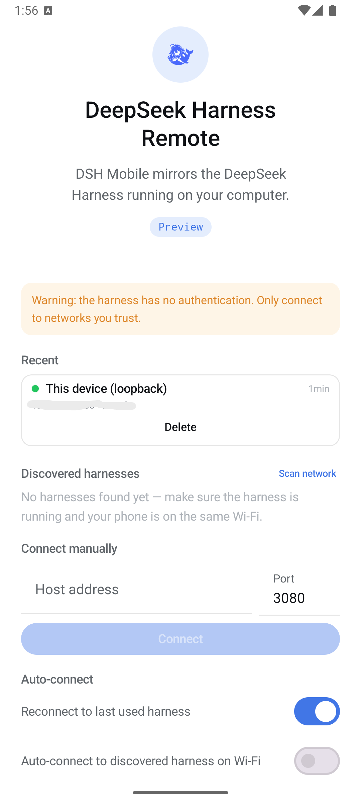
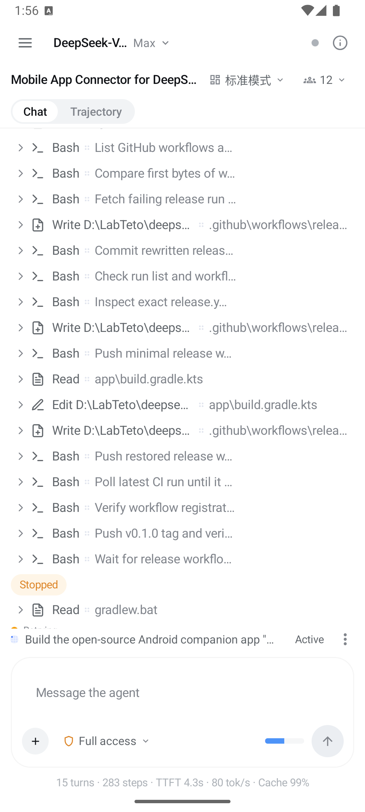
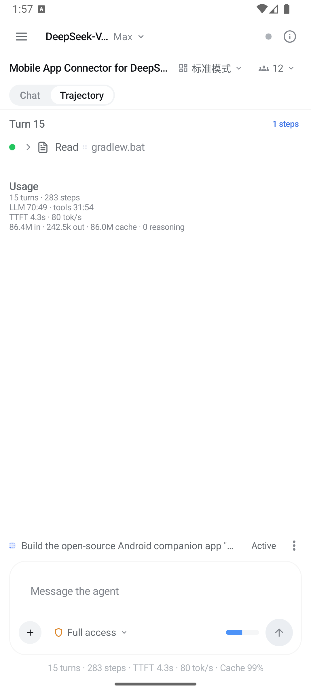
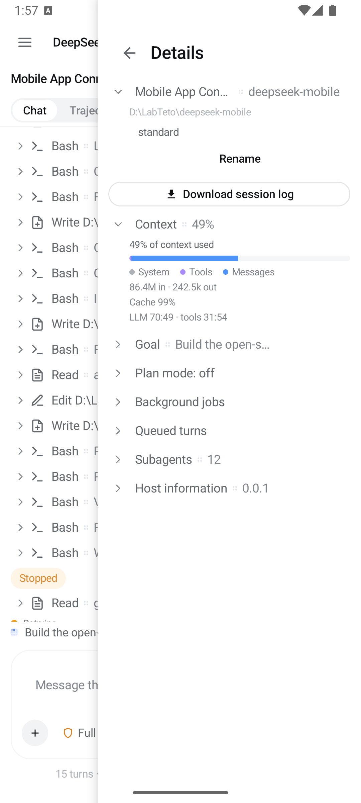
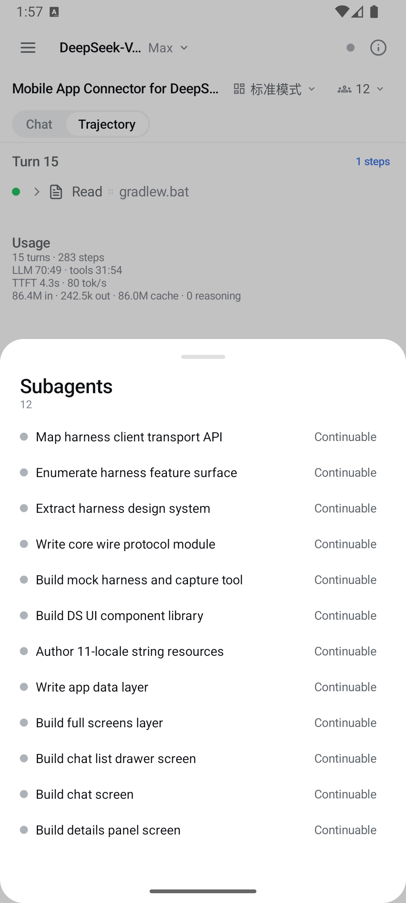

> 此目录是 DSH Remote 原生 Android 工作副本。新增的中央中继扫码接入见 [远程接入说明](../../docs/REMOTE-ACCESS.md)，固定来源见 [THIRD_PARTY.md](THIRD_PARTY.md)。下文保留上游的局域网接入与构建说明。

<p align="center">
  
</p>

<h1 align="center">DSH Mobile — DeepSeek Harness Remote</h1>

<p align="center">
  An open-source Android companion that puts your <b>DeepSeek Harness</b> in your pocket.<br>
  Drive sessions, review plans and goals, answer approvals and questions, and get notified
  when the harness finishes — from your phone, over your network or a relay.
</p>

<p align="center">
  <a href="https://dshm.zyphite.com"></a>
  <a href="https://github.com/sorsama/deepseek-harness-mobile/releases/latest"></a>
  <a href="https://github.com/sorsama/deepseek-harness-mobile/actions/workflows/ci.yml"></a>
  
  <a href="LICENSE"></a>
</p>

<p align="center">
  <b>English</b> ·
  <a href="README.zh-CN.md">中文</a> ·
  <a href="README.hi.md">हिन्दी</a> ·
  <a href="README.es.md">Español</a> ·
  <a href="README.fr.md">Français</a> ·
  <a href="README.th.md">ไทย</a>
</p>

DSH Mobile is an **unofficial companion app** for the
[DeepSeek Harness](https://github.com/deepseek-ai/deepseek-harness) (MIT). It mirrors the web GUI
feature for feature and uses the harness's own visual language. Android only, Kotlin + Jetpack
Compose.

Its companion on the other end is
[**dsh-relay**](https://github.com/sorsama/deepseek-harness-relay), a harness plugin that adds the
authentication layer the harness says it lacks, so this app can reach a harness with a real
credential and a pinned key instead of an open port. See
[Relay](https://github.com/sorsama/deepseek-harness-mobile/wiki/Relay).

**[dshm.zyphite.com](https://dshm.zyphite.com)** is the project site: what the app is, what it looks
like, and how to get it running, on one page.

The [**wiki**](https://github.com/sorsama/deepseek-harness-mobile/wiki) is the user-facing guide:
[getting started](https://github.com/sorsama/deepseek-harness-mobile/wiki/Getting-Started),
[connecting](https://github.com/sorsama/deepseek-harness-mobile/wiki/Connecting),
[troubleshooting](https://github.com/sorsama/deepseek-harness-mobile/wiki/Troubleshooting),
a [feature tour](https://github.com/sorsama/deepseek-harness-mobile/wiki/Feature-Tour) and an
[FAQ](https://github.com/sorsama/deepseek-harness-mobile/wiki/FAQ).

---

## Screenshots

| Connect | Chat | Trajectory |
|:--:|:--:|:--:|
|  |  |  |
| Recent harnesses with live reachability, LAN discovery, manual `host:port`, auto-connect. | Streamed turns, a glyph per tool, expandable tool cards, permission picker. | The same session as a per-turn ledger with usage totals. |

| Session details | Subagents |
|:--:|:--:|
|  |  |
| Context breakdown, goal, plan mode, background jobs, queued turns, host info, session-log export. | The subagent catalog — open a child's transcript, follow up, or interrupt it. |

## Features

- Connecting — finds a harness on your Wi-Fi with an active subnet scan and a readiness
  handshake, remembers hosts and probes them for liveness on the way in, takes a manual
  `host:port`, handles loopback for same-device setups, and auto-connects when you tell it to
  (last used, LAN, or same device).
- Navigation — the drawers work like Discord's: swipe right from the left edge for the
  workspace-grouped chat list, swipe left to close it, swipe left from the right edge for the
  session details panel.
- Chat — streamed turns with reasoning disclosure, markdown, terminal/diff/read/search/web tool
  cards, a queue dock where you can edit, remove or steer a queued turn, history paging, and
  multi-photo and file attachments. Drafts are kept per host and session.
- Workspace panels — tabbed text, Markdown, image, PDF and isolated HTML previews; native
  terminal controls with a bundled xterm renderer; archived-session restore in Settings.
- Message feedback — confirmed ratings and retraction, with version-conflict handling.
- Slash commands and skills — the composer checks a `/` line against the session's own command
  catalog and runs it through the harness's command gateway. Anything the catalog does not claim
  is sent as a prompt, which is how skills get invoked.
- Everything the GUI does — goals (phases, rounds, pause/resume/edit), plan mode and plan review,
  permission approvals, user questions, todo dock, subagents (catalog, follow-ups, interrupt),
  background jobs, workflow runs, skills, model selection, agent presets, session search,
  trajectory ledger, session export, message feedback.
- Notifications — turn complete, goal complete or blocked, review or question waiting for you.
  A foreground service keeps the connection alive in the background.
- Harness look — the exact DeepSeek Harness design tokens (colors, type, radii, disclosure rows,
  shimmer, ink buttons), with light, dark and system themes.
- 11 languages — English, 中文, हिन्दी, Español, Français, العربية, বাংলা, Português, Русский,
  اردو, ไทย (RTL aware).

## Requirements

- Android 8.0+ (minSdk 26).
- A running [DeepSeek Harness](https://github.com/deepseek-ai/deepseek-harness)
  at `0.2.0-rc.1` for DSH Mobile `0.12.1`; `0.1.7-rc.x` and `0.1.6-alpha.x` still work.
  See [compatibility](docs/COMPATIBILITY.md) and [validation results](docs/VALIDATION-0.11.0.md).

## Quick start

1. Install the latest APK from
   [Releases](https://github.com/sorsama/deepseek-harness-mobile/releases/latest).
2. Open the app and choose how to connect. Relay and local network are two different setups, not
   two settings of one, so pick the one that matches what you installed on the computer. The last
   two entries below are ways of running local-network mode.

   **Relay** — encrypted, authenticated, and works from outside your Wi-Fi.
   Install [`dsh-relay`](https://github.com/sorsama/deepseek-harness-relay) into
   the harness web profile:

   ```sh
   dsh plugin --profile web add dsh-relay
   dsh web
   ```

   Open the printed URL **on that computer**, set a password, then open
   `/relay/pair`. In the app: **Relay → Pair a relay**, scan the QR. Once every
   client you use has paired, turn off the relay's `compat.addressGrants`;
   nothing here needs it.

   **Local network** — apply the one-file LAN patch in
   [`harness/README.md`](harness/README.md), restart `dsh web`, then tap
   **Scan network**. The harness signs each device in once: paste the link it
   prints at startup when the app asks. That link authenticates the phone, but
   it does not encrypt the connection and it does not stop anyone already on the
   network from reaching the port, so use it only on networks you trust.

   **Behind your own HTTPS reverse proxy** — paste the `https://` address into
   local-network mode. The proxy can forward to loopback, so the harness needs
   no patch, but it encrypts the link without authenticating anyone. See
   [`harness/README.md`](harness/README.md).

   **USB / emulator** — `dsh web`, then `adb reverse tcp:3080 tcp:3080`, and
   connect to `127.0.0.1:3080` in local-network mode. No patch needed; the app
   still asks for the startup link once.
3. Pick a session, chat, and get notified when the harness is done.

If a connect attempt fails, the app names the cause, and the wiki's
[Troubleshooting](https://github.com/sorsama/deepseek-harness-mobile/wiki/Troubleshooting) page is
keyed on that exact sentence.

## Compatibility & security

- See [docs/COMPATIBILITY.md](docs/COMPATIBILITY.md) for the harness version matrix and what
  0.1.3 and 0.1.2 changed.
- **Read [docs/SECURITY.md](docs/SECURITY.md) first.** From harness 0.1.2 the harness authenticates
  its whole API, and a signed-in device reaches all of it; there is no longer a reduced tier for
  a caller that is not on the machine itself. Signing in grants the same power as a shell on that
  computer, because the agent runs commands there. Local-network mode authenticates but does not
  encrypt; relay mode adds a pinned certificate on top.

## Building

```sh
./gradlew :app:assembleDebug      # debug APK
./gradlew :app:assembleRelease    # release APK (signed when keystore env is set)
```

The shipped version comes from the git tag: the release workflow exports `DSH_VERSION_NAME` from
the tag name and derives `versionCode` from it. A local build falls back to the literal in
`app/build.gradle.kts`.

See [CONTRIBUTING.md](CONTRIBUTING.md) for the development loop against a real harness, the module
layout, and the release workflow.

## Repository

| Path | What |
|---|---|
| `core/` | Pure-JVM protocol core: wire DTOs, RPC client, WebSocket downlinks, reconnect loop, session folding, notification classifier |
| `app/` | Android UI: screens, discovery/connection, foreground service, notifications, i18n |
| `mock-harness/` | Ktor mock of the harness `/api` server for tests |
| `tools/capture/` | Records real harness traffic into conformance fixtures |
| `harness/` | Companion patch + guide for LAN mode |
| — | The relay itself lives in [sorsama/deepseek-harness-relay](https://github.com/sorsama/deepseek-harness-relay) |
| `docs/` | [Architecture](docs/ARCHITECTURE.md), [protocol notes](docs/PROTOCOL.md), [compatibility](docs/COMPATIBILITY.md), [security](docs/SECURITY.md) |

## License

[MIT](LICENSE). Bundled third-party material is listed in
[THIRD_PARTY_NOTICES.md](THIRD_PARTY_NOTICES.md). The DeepSeek Harness and its brand are property
of their respective owners; this project is an independent, community-built remote.
